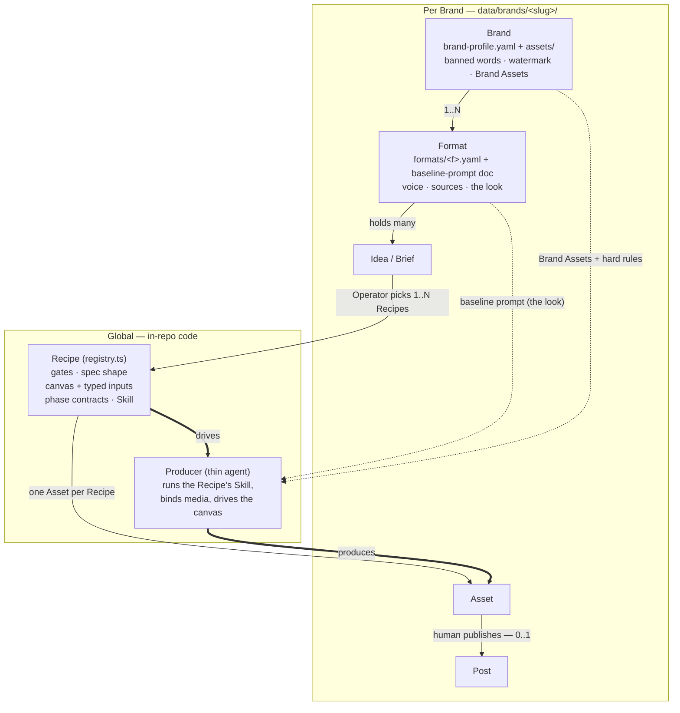
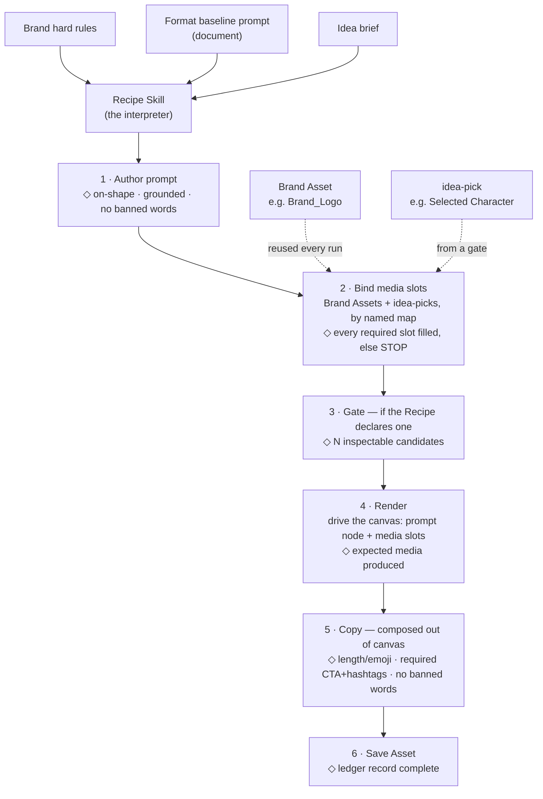

# The Recipe / Format architecture — the four owners, drawn

The canonical picture of how **Brand · Format · Recipe · Producer** relate, and how one run stays
auditable. Decided in the 2026-07 recipe-architecture wayfinding (map #70); see ADR-0015, ADR-0016,
ADR-0017, ADR-0018. Terms are defined in [`CONTEXT.md`](../../CONTEXT.md). **Decided, build pending.**

## The four owners

| Owner | Holds | Scope |
|---|---|---|
| **Recipe** (`src/recipe/registry.ts`) | gates · Production-Spec shape · which canvas · the canvas's typed inputs (media slots + prompt node) · phase contracts · its producer **Skill** | global / in-repo |
| **Format** (`formats/<f>.yaml` + a referenced **baseline-prompt** doc) | voice · trend sources · the **look** (baseline prompt: definitions + a core example + samples) | Brand × Format |
| **Brand** (`brand-profile.yaml` + `assets/`) | banned words · watermark @handle · **Brand Assets** (image/video/audio) | per Brand |
| **Producer** (thin agent + per-Recipe Skill) | authors the prompt to the phase contract · binds media into the slots · drives the canvas attended, pausing only at declared gates | the worker |

## Ownership & cardinality

## One run — phases, each with a contract the Producer self-audits (and QA re-runs)

The Recipe's canvas takes **two typed inputs**: a **prompt node** the Producer authors, and **media slots**
filled by Brand Assets (reused) or idea-picks (per Idea). Each phase carries a checklist contract; the
Producer never advances past a failing one (`◇` = the phase's contract).

**Legend.** Aspect ratio and model (3:4, Nano Banana 2 for the news carousel) are the canvas's own
settings, not clauses in the prompt. The carousel declares **zero** gates (it runs straight through); the
character Recipe declares one (the **Cast** pick).
